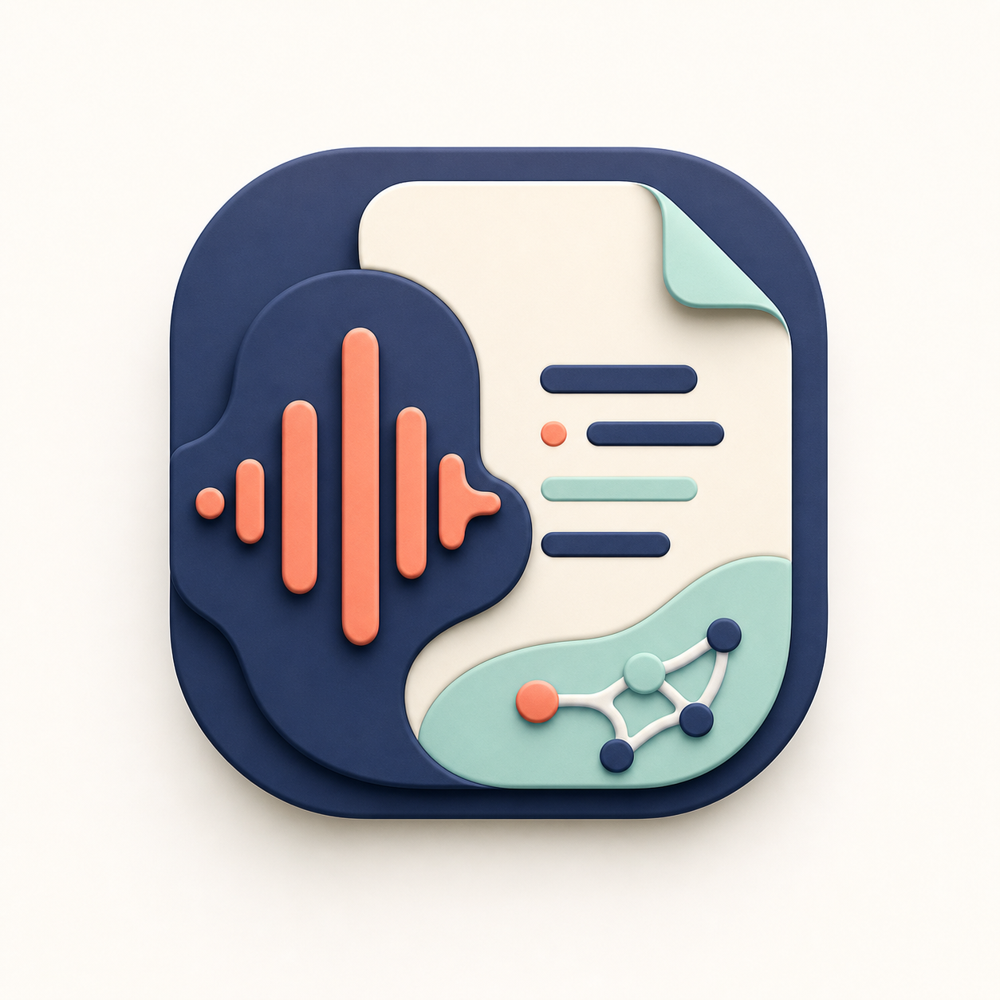
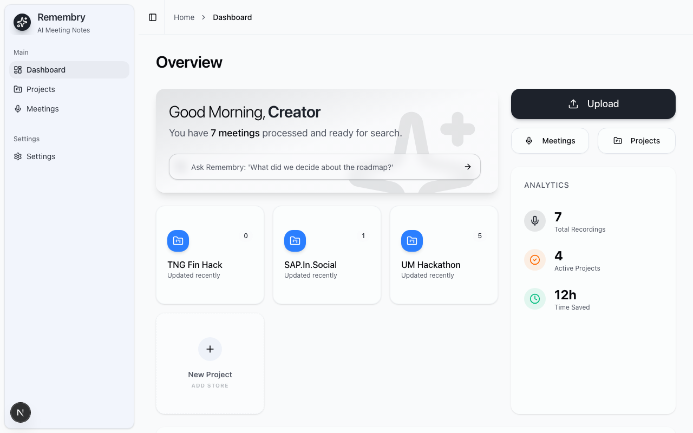
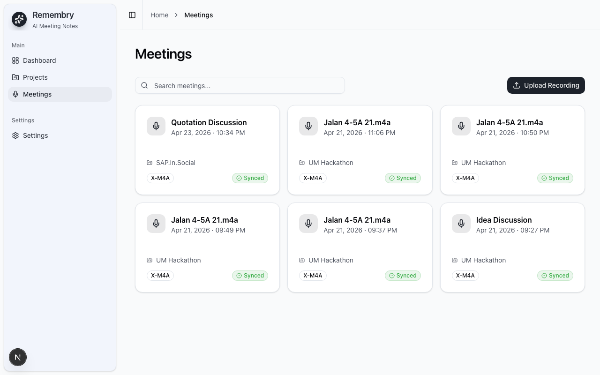
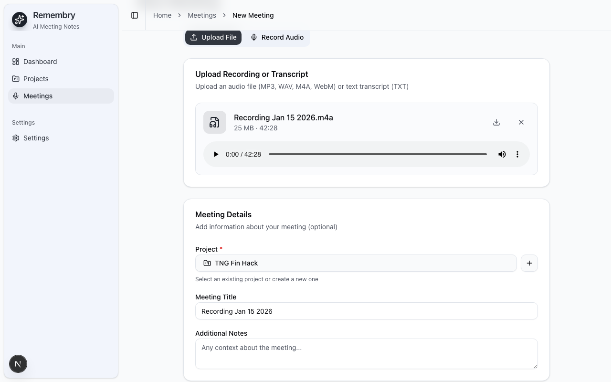

<p align="center">
  
</p>

<p align="center">
  
</p>

<p align="center">
  <a href="https://nextjs.org/"></a>
  <a href="https://tauri.app/"></a>
  <a href="https://www.rust-lang.org/"></a>
  <a href="https://ai.google.dev/"></a>
  
  
</p>

<p align="center">
  <strong>Remembry</strong> is a self-hosted AI-powered meeting notes desktop application. Meeting data is stored locally, while transcription and note generation use the Gemini API.
</p>

---

## Features

- **Audio recording** - Record directly in-app with microphone support.
- **File upload** - Upload MP3, WAV, M4A, WebM, or MP4 files.
- **AI transcription** - Generate transcripts with speaker diarization.
- **Smart extraction** - Extract summaries, decisions, action items, Q&A pairs, and key points.
- **Multi-language notes** - Generate notes in multiple output languages.
- **Local storage** - Store projects, meetings, notes, transcripts, and settings in a local SQLite database.

---

## Downloads

Get the latest version from [GitHub Releases](https://github.com/kongjiyu/remembry-app/releases/latest).

| Platform | File | Notes |
|----------|------|-------|
| macOS (Apple Silicon) | `Remembry_0.2.0_aarch64.dmg` | Notarized for Gatekeeper |
| Windows (NSIS) | `Remembry_0.2.0_x64-setup.exe` | Installer wizard |
| Windows (MSI) | `Remembry_0.2.0_x64_en-US.msi` | Enterprise deployment |

---

## Screenshots

| Page | Preview |
|------|---------|
| **Dashboard** |  |
| **Meetings List** |  |
| **Upload Meeting** |  |
| **Settings** |  |

---

## Tech Stack

| Layer | Technology |
|-------|------------|
| Desktop runtime | Tauri 2.x |
| Backend | Rust |
| Frontend | Next.js 16, React 19, Tailwind CSS v4, shadcn/ui |
| AI | Google Gemini |
| Database | SQLite |

---


# 1. Problem Statement

Modern SMEs increasingly rely on meetings, brainstorming sessions, operational discussions, and collaborative decision-making to manage projects and business operations. However, a large portion of organizational knowledge generated during these discussions is either poorly documented, scattered across multiple tools, or completely lost over time.

In many organizations, employees are required to simultaneously participate in discussions while manually taking notes, tracking action items, and remembering important decisions. This often results in incomplete meeting records, inconsistent documentation, and missing operational context. Meeting recordings are also rarely revisited due to the amount of time required to manually search through lengthy audio files.

As organizations grow, this creates a major operational challenge where knowledge becomes fragmented and heavily dependent on individual employees rather than structured systems. When employees resign or teams change, historical project decisions, technical discussions, and business reasoning are frequently lost, causing repeated discussions, onboarding difficulties, and project continuity issues.

At the same time, current AI meeting assistant platforms introduce additional concerns surrounding privacy and operational trust. Most existing transcription tools rely heavily on cloud-first infrastructures where sensitive business discussions are uploaded and stored on third-party servers. SMEs handling confidential operational discussions, financial information, client conversations, or strategic planning are increasingly hesitant to adopt such systems due to data privacy and compliance concerns.

In addition, the current productivity ecosystem has become fragmented and subscription-heavy. Organizations are often required to pay separately for transcription tools, note-taking systems, collaboration software, and cloud storage services, while still lacking a unified and searchable organizational memory platform.

More importantly, existing solutions mainly focus on transcription and summarization rather than preserving long-term organizational knowledge. Meetings are treated as isolated sessions instead of connected business contexts. As a result, organizations struggle to:

* Track historical business decisions
* Understand the reasoning behind past operational changes
* Identify unresolved recurring issues
* Preserve institutional knowledge during employee turnover
* Maintain continuity across projects and departments

This creates a growing need for a privacy-first platform capable of transforming raw discussions into structured, searchable, and long-term organizational memory.

---

# 2. Stakeholder / Persona

## 2.1 Primary Stakeholders

Remembry is built for SME decision-makers — founders, COOs, and operations leaders who are responsible for meeting outcomes, organizational continuity, budgeting, and risk management.

Secondary stakeholders include team leads who run cross-functional meetings and deal with lost decisions, repeated discussions, and fragmented documentation.

## 2.2 Key Challenges

These stakeholders commonly face:

* Critical decisions lost after meetings
* Knowledge scattered across chat, documents, and recordings
* Employee turnover disrupting continuity and onboarding
* Privacy and compliance concerns with cloud-first AI tools
* Subscription fatigue across multiple SaaS systems

## 2.3 What Success Looks Like

Decision-makers look for solutions that deliver:

* **Trust** — full data ownership with local storage
* **Speed** — rapid retrieval of decisions and context
* **Cost control** — no per-seat subscription lock-in
* **Easy adoption** — lightweight setup and minimal IT overhead

## 2.4 Common Buying Triggers

Adoption is most likely when:

* Key employees leave and knowledge gaps appear
* Compliance or confidentiality concerns rise
* Meeting volume increases during growth
* Leadership wants measurable productivity improvements

## 2.5 Common Objections

Typical pre-purchase questions include:

* Will the AI be accurate enough for real decisions?
* Is it truly private if AI is involved?
* Can it fit our workflow without disruption?

---

# 3. Proposed Solution

## 3.1 Overview

Remembry is a privacy-first desktop application designed to transform meeting recordings into structured, searchable, and long-term organizational knowledge using multi-modal AI technologies.

Rather than functioning solely as a transcription application, Remembry aims to become an intelligent organizational memory platform that helps SMEs preserve business discussions, operational decisions, project continuity, and institutional knowledge.

The platform allows users to upload or record meeting audio directly within the application. AI-powered transcription and extraction pipelines are then used to generate:

* Structured summaries
* Action items
* Decisions made during meetings
* Q&A records
* Key discussion points
* Technical insights
* Operational concepts and contextual knowledge

Unlike traditional cloud-first AI platforms, all processed information is stored locally using SQLite databases. Sensitive meeting data remains under the organization's control, reducing privacy concerns while improving operational trust.

Users may also utilize their own Gemini API keys, reducing vendor lock-in and minimizing subscription barriers for SMEs.

---

## 3.2 Core Features

### Privacy-First Local Architecture

Remembry adopts a local-first architecture where transcripts, extracted knowledge, and meeting records remain stored locally on the user's device rather than permanently stored on external cloud infrastructures.

This improves:

* Privacy
* Data ownership
* Compliance readiness
* Organizational trust

---

### AI-Powered Structured Knowledge Extraction

The system uses multi-modal AI models to transform raw meeting audio into structured business knowledge instead of plain transcripts.

Generated outputs include:

* Summaries
* Action items
* Decisions
* Insights
* Evidence snippets
* Discussion highlights
* Semantic concepts

This enables users to revisit important discussions efficiently without manually reviewing lengthy recordings.

---

### Searchable Organizational Memory

Remembry introduces semantic search and contextual retrieval across historical meetings and projects.

Users may ask:

* "Why was Project Alpha postponed?"
* "What issues were repeatedly mentioned by clients?"
* "Which unresolved technical problems appeared across meetings?"

The system retrieves related contextual discussions and historical decision records.

---

### Project-Based Knowledge Organization

Meetings and transcripts are grouped into projects and workspaces to maintain continuity across long-term initiatives.

This reduces information fragmentation while improving organizational traceability.

---

### Operational Continuity Support

Remembry helps preserve organizational knowledge during employee turnover by retaining:

* Historical discussions
* Project reasoning
* Technical decisions
* Operational context

Future versions may automatically generate continuity summaries and handover reports for onboarding and operational transition support.

---

# 4. Target Market

## 4.1 Ideal Customer Profile

Remembry targets SMEs (roughly 10–200 employees) that rely heavily on meetings and collaborative decisions, especially teams handling sensitive or regulated information.

## 4.2 Best-Fit Industries

Strongest fit includes:

* Professional services
* Agencies
* SaaS startups
* Consulting firms
* Legal operations
* Healthcare administration
* Financial operations

## 4.3 Core Job-To-Be-Done

Turn meetings into durable, searchable organizational memory.

## 4.4 Behavioral Signals

Ideal customers often:

* Depend on manual note-taking and messy recordings
* Use multiple disconnected tools with no unified memory system
* Avoid cloud transcription due to confidentiality concerns

## 4.5 Compliance and Geographic Fit

The product is especially attractive where GDPR, HIPAA, or data residency constraints apply.

## 4.6 Expansion Opportunity

Adoption typically progresses from a single team to multi-team workspaces as trust and usage grow.

---

# 5. Competitor Analysis

Current AI meeting assistant tools are mostly positioned around transcription, meeting summaries, and cloud-based collaboration. Remembry takes a different position: it focuses on privacy-first storage, low adoption cost, and long-term organizational memory for SMEs.

## 5.1 Feature Comparison

| Dimension              | Remembry                                                      | Otter.ai                               | Fireflies.ai                           | CAST                          |
| ---------------------- | ------------------------------------------------------------- | -------------------------------------- | -------------------------------------- | ----------------------------- |
| Local storage          | ✅ Full privacy                                                | ❌ Cloud-only                           | ❌ Cloud-only                           | ❌ Cloud-only                  |
| Self API key           | ✅ No vendor lock-in                                           | ❌ Owned by Otter                       | ❌ Owned by Fireflies                   | ❌ Owned by CAST               |
| Pricing barrier        | ✅ Free with Gemini free tier / BYO API key                    | ❌ Paid plan required for heavier usage | ❌ Paid plan required for heavier usage | ❌ Paid plan required          |
| On-premise deployment  | ✅ Possible future deployment model                            | ❌ Limited                              | ❌ Limited                              | ❌ Limited                     |
| Multi-language support | ✅ Model-dependent, expandable                                 | ⚠️ Available but plan-dependent        | ✅ 100+ languages                       | ✅ Available                   |
| Rich knowledge schema  | ✅ Concepts, insights, decisions, sentiment, evidence snippets | ⚠️ Meeting summaries and AI chat       | ⚠️ Summaries, action items, analytics  | ⚠️ Basic meeting intelligence |
| Interrupt recovery     | ✅ Startup cleanup and recovery                                | ❌ Not a key differentiator             | ⚠️ Partial                             | ⚠️ Partial                    |
| Organizational memory  | ✅ Core product direction                                      | ⚠️ Meeting knowledge base              | ⚠️ Meeting searchable archive          | ⚠️ Meeting archive            |
| Data ownership         | ✅ User-controlled local database                              | ⚠️ Vendor-managed cloud                | ⚠️ Vendor-managed cloud                | ⚠️ Vendor-managed cloud       |

---

## 5.2 Measurable Productivity and Operational Metrics

To strengthen practical business value, Remembry focuses on measurable operational improvements instead of only AI convenience.

The following metrics demonstrate how the platform may improve productivity and organizational efficiency for SMEs.

| Metric                           | Existing Workflow Problem                                                                    | Potential Improvement with Remembry                                         |
| -------------------------------- | -------------------------------------------------------------------------------------------- | --------------------------------------------------------------------------- |
| Meeting review time              | Employees may spend 30–60 minutes revisiting recordings or searching manually through notes. | Reduce meeting review effort by approximately 75%.                          |
| Action item tracking             | Important action items are often forgotten or buried inside discussions.                     | Reduce missed action items by approximately 60%.                            |
| Knowledge retrieval speed        | Teams may require hours or days to locate historical discussions and decisions.              | Reduce historical information retrieval time by approximately 85–90%.       |
| Onboarding efficiency            | New employees often depend heavily on manual handovers and undocumented knowledge.           | Improve onboarding and project understanding speed by approximately 50–65%. |
| Repeated discussion frequency    | Teams frequently revisit previously discussed issues due to lack of documentation.           | Reduce duplicated operational discussions by approximately 40–55%.          |
| Documentation consistency        | Manual note-taking quality varies between employees.                                         | Improve documentation consistency by approximately 70%.                     |
| Meeting post-processing workload | Employees manually summarize meetings after discussions end.                                 | Reduce post-meeting administrative workload by approximately 70–80%.        |
| Operational continuity           | Knowledge may disappear when employees resign or teams change.                               | Reduce organizational knowledge loss risk by approximately 50–60%.          |

---

## 5.3 Example SME Productivity Impact

Assume an SME team conducts:

* 5 meetings per day
* Average meeting duration of 1 hour
* 10 employees involved in operational discussions

Traditional workflow assumptions:

| Activity                          | Estimated Manual Effort                                 |
| --------------------------------- | ------------------------------------------------------- |
| Manual note cleanup after meeting | 15–30 minutes per meeting                               |
| Searching historical discussions  | 10–20 minutes per request                               |
| Preparing onboarding handovers    | Several hours to days                                   |
| Reconstructing project decisions  | Often requires multiple meetings or employee dependency |

Potential impact with Remembry:

| Operational Area                      | Potential Productivity Improvement                        |
| ------------------------------------- | --------------------------------------------------------- |
| Meeting summarization effort          | Reduced by approximately 75%                              |
| Historical knowledge retrieval        | Improve retrieval speed by approximately 85–90%           |
| Repeated discussion overhead          | Reduced by approximately 40–55%                           |
| Administrative documentation workload | Reduced by approximately 70–80%                           |
| Employee onboarding context gathering | Improved onboarding efficiency by approximately 50–65%    |
| Operational continuity risk           | Reduced knowledge dependency risk by approximately 50–60% |

The core value proposition is not simply AI transcription.

The larger impact comes from reducing operational friction, minimizing knowledge loss, and improving long-term organizational continuity.

---

## 5.4 Competitive Positioning Summary

Assume a small SME team has 10 users who need AI meeting notes.

| Product      |                 Estimated Entry Paid Plan | Estimated Monthly Cost for 10 Users | Notes                                                             |
| ------------ | ----------------------------------------: | ----------------------------------: | ----------------------------------------------------------------- |
| Remembry     |   $0 platform fee + user-managed AI usage |                   Low / usage-based | Best for SMEs that want cost control and local ownership.         |
| Otter.ai     | Around $16.99/user/month monthly Pro plan |                Around $169.90/month | Subscription-based model; higher plans needed for team features.  |
| Fireflies.ai |    Around $18/user/month monthly Pro plan |                   Around $180/month | Subscription-based model; business features require higher tiers. |
| CAST         |          Around $20/user/month assumption |                   Around $200/month | Pricing should be verified before final submission.               |

The key argument is not that Remembry is always free forever. The stronger argument is that Remembry separates the application layer from the AI provider cost. This gives SMEs better control over spending, privacy, and future AI model selection.

Most competitors compete on transcription convenience. Remembry competes on organizational memory.

This difference is important because transcription and summarization are becoming commodity AI features. Long-term differentiation will come from how well the system preserves business context, connects decisions across time, and supports operational continuity.

Remembry's competitive positioning can be summarized as:

> A privacy-first organizational memory platform for SMEs, not just another AI meeting note taker.

---

# 6. Business Model

## 6.1 Core Model

* $0 platform fee
* Customers bring their own Gemini API key
* AI usage costs remain fully under customer control

This removes vendor lock-in while keeping adoption low-friction for SMEs.

## 6.2 Core Differentiation

* Local-first storage
* Structured knowledge extraction
* Long-term organizational memory, not just transcription

## 6.3 Pricing Advantages

* No per-seat subscription cost creep
* Costs scale with actual usage
* Direct control over AI spending

## 6.4 Future Monetization Paths

Potential expansions include:

* Team workspace management
* Advanced admin and permission controls
* On-prem enterprise packages
* Premium analytics and knowledge graph features
* Paid integrations (Notion, Confluence, etc.)

## 6.5 Retention Drivers

The product becomes more valuable over time as organizational knowledge accumulates and searchability improves.

---

# 7. Go-to-Market Strategy

## 7.1 Positioning

The product is positioned as a **privacy-first organizational memory platform for SMEs**, rather than simply another AI meeting transcription tool.

Most existing meeting tools focus mainly on converting speech into text. While transcription is useful, it does not solve the larger business problem: organizations continuously lose decisions, context, and institutional knowledge after meetings end.

This platform focuses on helping SMEs preserve and retrieve organizational knowledge in a structured and searchable way. Instead of creating another collection of recordings and transcripts, the system transforms meetings into reusable business intelligence, including summaries, decisions, action items, and contextual Q&A.

The positioning emphasizes three core differentiators:

* **Privacy-first architecture** through local storage and customer-controlled AI usage
* **Organizational memory** instead of simple transcription
* **SME-focused simplicity** with low adoption friction and transparent cost structure

The key positioning statement is:

> “Privacy-first organizational memory for SMEs — not just another meeting note app.”

This messaging is designed to resonate strongly with founders, operations leaders, and privacy-conscious organizations that are dissatisfied with cloud-dependent AI meeting platforms.

---

## 7.2 Entry Wedge

The primary market entry strategy combines two highly attractive adoption drivers for SMEs:

### Privacy-First Local Storage

Many SMEs are increasingly concerned about uploading confidential discussions, client conversations, financial information, or internal operational data to third-party cloud services.

The platform addresses this concern directly by using a local-first architecture, where meeting data and organizational knowledge remain under the customer’s control instead of being permanently stored on external servers.

This creates a strong trust advantage, especially for businesses operating in regulated or confidentiality-sensitive industries.

### Cost Control Through BYO API Key

Traditional AI SaaS products often introduce unpredictable subscription costs, seat-based pricing, or premium feature paywalls as usage grows.

Instead, the platform adopts a Bring-Your-Own (BYO) Gemini API key model, allowing customers to:

* Control their own AI usage costs
* Avoid expensive per-user subscription scaling
* Maintain transparency over operational expenses
* Reduce long-term vendor lock-in concerns

This pricing model lowers the barrier to adoption because businesses can start using the platform without committing to another recurring enterprise subscription.

Together, privacy and cost control create a highly effective entry wedge into the SME market.

---

## 7.3 Acquisition Channels

The go-to-market approach focuses on highly targeted, relationship-driven acquisition channels rather than expensive mass-market advertising.

### Direct Demos to SME Decision-Makers

The primary acquisition channel is direct product demonstrations to founders, COOs, and operations managers.

Because the product solves workflow and organizational continuity problems, live demonstrations are highly effective at showing immediate value. Decision-makers can quickly understand how the platform captures meeting knowledge, retrieves past decisions, and improves operational continuity.

Demo-led selling also helps overcome skepticism around AI accuracy and workflow integration.

### Founder-Led Outreach

Early-stage growth relies heavily on founder-led outreach into operations and business leadership communities.

This includes engaging with:

* COO communities
* Operations-focused forums
* SME business groups
* Startup founder networks
* LinkedIn operational leadership circles

Founder-led communication helps establish trust and credibility, especially when discussing privacy, operational efficiency, and knowledge management challenges.

### Product-Led Adoption

To reduce adoption friction, the product includes a lightweight onboarding experience with a free entry point.

Potential users can quickly test the platform without long procurement cycles or complicated enterprise onboarding. This allows SMEs to experience value rapidly before wider organizational adoption.

The onboarding experience is intentionally designed to require minimal technical expertise.

---

## 7.4 Messaging Themes

The marketing and communication strategy revolves around operational pain points that SME leaders already experience daily.

### “Stop Losing Decisions”

Many organizations repeatedly revisit discussions because important decisions become buried inside recordings, chat tools, or scattered notes.

This message highlights the cost of poor organizational memory and positions the platform as a solution for preserving operational continuity.

### “Own Your Data, Keep It Local”

Privacy concerns are becoming increasingly important as businesses adopt AI-powered workflows.

This message reinforces the platform’s local-first architecture and customer-controlled data ownership model, helping differentiate it from cloud-dependent competitors.

### “Searchable Memory, Not Just Transcripts”

This message emphasizes that the platform is not merely converting audio into text.

Instead, it transforms meetings into structured, searchable organizational knowledge that teams can retrieve and reuse over time.

This distinction is critical because it shifts the conversation from “meeting recording” toward “business intelligence and continuity.”

---

## 7.5 Proof Points

The platform’s value proposition is supported by several measurable operational improvements.

### Faster Decision Retrieval

Teams can retrieve past discussions, decisions, and action items within seconds instead of manually searching through recordings, notes, or chat histories.

This reduces wasted time and improves operational efficiency.

### Fewer Repeated Meetings

Organizations often repeat conversations because prior decisions are difficult to locate or poorly documented.

By creating structured organizational memory, the platform reduces duplicated discussions and improves alignment across teams.

### Improved Compliance and Privacy Posture

Because the system is designed around local-first storage and customer-controlled AI usage, businesses can reduce concerns around sensitive cloud data exposure.

This is particularly valuable for organizations operating under confidentiality requirements or regulatory frameworks.

### Lower Total Cost

Compared to subscription-based AI meeting tools, the BYO API model provides more transparent and scalable cost management.

Businesses avoid paying increasing seat-based fees as teams grow, making the platform financially attractive for SMEs with expanding operations.

---

## 7.6 Adoption Flow

The onboarding experience is intentionally simple to minimize technical friction and accelerate time-to-value.

### Step 1: Install the Desktop Application

Users begin by installing the desktop application locally within their working environment.

The setup process is lightweight and does not require complex infrastructure deployment.

### Step 2: Add Gemini API Key

Users connect their own Gemini API key to enable AI processing capabilities.

This gives customers direct ownership and visibility over AI usage and costs.

### Step 3: Upload or Record Meetings

Teams can either upload existing meeting recordings or record meetings directly through the platform.

The system then processes the content automatically.

### Step 4: Receive Structured Organizational Knowledge

Instead of generating only raw transcripts, the platform produces:

* Meeting summaries
* Key decisions
* Action items
* Contextual Q&A
* Searchable organizational memory

Users can immediately search and retrieve knowledge from past meetings, creating instant operational value.

---

## 7.7 Early Partnerships

Early growth partnerships focus on ecosystems where SME decision-makers already gather and collaborate.

### SME Accelerators

Partnerships with SME and startup accelerators provide direct access to growing companies that already experience scaling and operational continuity challenges.

### Co-Working Communities

Co-working spaces often contain startups, agencies, and small operations-heavy businesses that rely heavily on meetings and collaboration.

These communities provide strong early adoption opportunities.

### Local Business Networks

Regional SME business associations and networking communities offer access to privacy-conscious business owners seeking operational improvements.

### Founder and Operations Communities

Operations leaders and founders are highly aligned with the product’s value proposition because they directly experience the cost of lost organizational knowledge.

Building visibility within these communities helps create trust-driven organic adoption and referrals.

---

# 8. Scalability and Future Roadmap

## Phase 1 — MVP Foundation

The current MVP focuses on:

* Audio recording and upload
* AI transcription
* Structured note extraction
* Semantic search and Q&A
* Local SQLite storage
* Project-based organization
* Background processing and recovery handling

This phase validates the core workflow while maintaining low operational complexity and affordable adoption for SMEs.

---

## Phase 2 — Platform Expansion

The next development phase focuses on improving flexibility, accessibility, and interoperability.

Planned enhancements include:

* Multi-model AI support
* Plugin-based extraction pipelines
* Notion and Confluence integrations
* Cross-platform desktop support
* Mobile recording applications
* Team collaboration workspaces

This allows organizations to integrate Remembry into existing operational ecosystems.

---

## Phase 3 — Organizational Intelligence

As large language models continue improving in reasoning and contextual understanding, Remembry will evolve into an organizational intelligence platform.

Future AI capabilities may include:

* Cross-meeting contextual analysis
* Decision-tracking systems
* Recurring issue detection
* Project continuity reconstruction
* Historical operational reasoning retrieval
* Unresolved task identification
* AI-generated operational summaries

To make scalability measurable, this phase can introduce operational intelligence metrics such as:

| Future Metric                 | Purpose                                                                                           |
| ----------------------------- | ------------------------------------------------------------------------------------------------- |
| Decision Traceability Rate    | Measures how many important decisions can be linked back to meeting evidence.                     |
| Unresolved Action Item Count  | Tracks action items that remain open across meetings.                                             |
| Recurring Issue Frequency     | Detects problems repeatedly mentioned across multiple discussions.                                |
| Project Memory Coverage       | Measures how much of a project timeline is supported by recorded discussions and extracted notes. |
| Knowledge Retrieval Time      | Measures how quickly users can find past decisions compared with manual searching.                |
| Handover Summary Completeness | Measures how well the system can generate useful onboarding or transition summaries.              |

The platform may eventually identify:

* Recurring operational bottlenecks
* Repeated customer complaints
* Long-standing unresolved issues
* Missing task ownership
* Frequently discussed risks

This transforms Remembry from a meeting assistant into a long-term organizational memory layer.

---

## Phase 4 — AI-Powered Organizational Knowledge Graph

Future versions of Remembry may introduce AI-powered organizational knowledge graphs capable of understanding relationships between:

* People
* Teams
* Projects
* Decisions
* Operational issues
* Customer discussions
* Organizational timelines

As future LLMs become more context-aware and reliable, the platform may provide:

* Intelligent project continuity summaries
* AI-assisted onboarding support
* Compliance and audit trail generation
* Organizational knowledge mapping
* AI-assisted operational recommendations
* Institutional knowledge preservation

---

## 8.5 Scalability Metrics for Future Evaluation

As the platform evolves, scalability can be measured through operational and productivity-focused indicators.

| Scalability Area                  | Measurable Metric                                                 | Long-Term Goal                                                  |
| --------------------------------- | ----------------------------------------------------------------- | --------------------------------------------------------------- |
| Knowledge retrieval efficiency    | Average time required to locate historical decisions              | Reduce retrieval from hours to seconds                          |
| Documentation workload reduction  | Reduction in manual post-meeting documentation effort             | Reduce repetitive documentation work by over 70%                |
| Meeting continuity                | Percentage of meetings linked with historical context             | Improve organizational memory continuity                        |
| Action item visibility            | Number of unresolved tasks automatically detected                 | Improve management visibility and follow-up                     |
| Organizational knowledge coverage | Percentage of project discussions preserved structurally          | Increase searchable institutional knowledge                     |
| Employee onboarding efficiency    | Time required for new employees to understand project history     | Accelerate onboarding through AI-generated continuity summaries |
| Cross-project intelligence        | Number of recurring operational issues identified across meetings | Improve operational awareness                                   |
| Historical traceability           | Percentage of major decisions linked to supporting discussions    | Strengthen auditability and operational reasoning               |

These metrics position Remembry as intelligent business memory infrastructure rather than merely a productivity application.

---

# 9. Why Now?

## 9.1 Multi-Modal AI Has Reached Practical Maturity

Recent advancements in multi-modal AI models such as Gemini, GPT-4o, and Whisper have significantly reduced the cost and complexity of transcription and semantic extraction.

Modern AI systems are now capable of:

* Processing audio efficiently
* Understanding contextual discussions
* Generating structured summaries
* Performing semantic retrieval
* Extracting organizational knowledge at low operational cost

This creates an opportunity for SMEs to adopt AI-powered knowledge systems without requiring expensive enterprise infrastructure.

---

## 9.2 Privacy-First AI Is Becoming Increasingly Important

Organizations are becoming increasingly cautious about uploading confidential operational discussions to third-party cloud platforms.

Growing concerns surrounding:

* Data privacy
* Compliance requirements
* Data residency
* Operational trust

have accelerated the demand for local-first AI systems.

Remembry aligns directly with this industry shift by prioritizing local storage and user-controlled AI infrastructure.

---

## 9.3 Organizational Knowledge Loss Is Increasing

As businesses become increasingly meeting-intensive and collaborative, organizational knowledge is becoming fragmented across recordings, documents, messaging platforms, and employee memory.

SMEs are particularly vulnerable because:

* Operational knowledge is often undocumented
* Teams are smaller and highly dependent on individuals
* Employee turnover creates continuity challenges
* Historical business context is difficult to retrieve

Remembry addresses this issue by preserving discussions as structured and searchable institutional memory.

---

## 9.4 Current Market Solutions Remain Incomplete

Most existing AI meeting platforms primarily focus on:

* Transcription
* Meeting summaries
* Cloud collaboration

Very few platforms focus on:

* Organizational memory
* Historical contextual intelligence
* Operational continuity
* Decision reconstruction
* Privacy-first deployment models

This creates a strategic opportunity for Remembry to establish itself within a relatively underserved market segment.

---

# 10. Conclusion

Remembry proposes a privacy-first organizational memory platform that leverages multi-modal AI technologies to help SMEs preserve, retrieve, and utilize business knowledge more effectively.

Rather than functioning solely as a transcription tool, the platform aims to evolve into a long-term operational intelligence layer capable of supporting organizational continuity, historical reasoning retrieval, institutional knowledge preservation, and AI-assisted operational awareness.

As AI technologies continue advancing, the importance of structured and searchable organizational memory is expected to increase significantly. Remembry positions itself at the intersection of privacy-first AI, operational intelligence, and long-term business knowledge management.

---

## Developer Quick Start

### Prerequisites

Install these before running the app:

- Node.js `20.9.0` or later. Next.js 16 will not run on Node 18.
- npm, included with Node.js.
- Rust `1.75` or later, including `cargo`.
- Tauri 2 system prerequisites for your OS.
  - Windows: Microsoft C++ Build Tools and WebView2 Runtime.
  - macOS/Linux: follow the official Tauri prerequisites for your platform.
- Gemini API key from [Google AI Studio](https://aistudio.google.com/app/apikey).

### Run the App

```bash
git clone https://github.com/kongjiyu/remembry.git
cd remembry
npm install
npm run tauri:dev
```

`npm run tauri:dev` starts the Next.js dev server through Tauri and opens the desktop app.

After the app opens:

1. Go to **Settings**.
2. Paste your Gemini API key.
3. Click **Save**.
4. Create a project, then upload or record a meeting.

The Gemini key is stored in the operating system credential store through the Rust backend. A `.env.local` file is not required for normal development.

### Useful Commands

| Command | Description |
|---------|-------------|
| `npm run tauri:dev` | Start the Tauri desktop app in development mode. |
| `npm run tauri:build` | Build the production desktop bundle. |
| `npm run build:tauri` | Build the exported Next.js frontend only. |
| `npm run lint` | Run ESLint. |
| `npm run test:run` | Run unit tests once. |
| `npm run test` | Run Vitest in watch mode. |

### Notes for Developers

- `npm run tauri:dev` loads the app from `http://localhost:3010` (the Next.js dev server) for live frontend changes with HMR.
- `npm run build` (or `npm run build:tauri`) is only needed to regenerate the static `out/` directory for production Tauri builds.
- If the frontend looks stale in the Tauri window, restart `npm run tauri:dev` — do not rebuild.
- Do not use `npm run dev` as the main app entry point. It only starts the Next.js frontend in a browser, where Tauri commands are unavailable.
- If upload or note generation fails with a missing API key error, reopen **Settings** and save the key again.
- If Windows build tooling is missing, Tauri/Rust compilation may fail before the app window opens.

---

## User Guide

### Step 1: Save Your API Key

1. Open **Settings** from the sidebar.
2. Enter your Gemini API key.
3. Click **Save**.


### Step 2: Create a Project

1. Click **New Project** on the Dashboard.
2. Enter a project name, such as "Team Meeting" or "Client Call".
3. Choose a color.
4. Click **Create**.

### Step 3: Upload a Recording

1. Click **Upload** on the sidebar or Dashboard.
2. Select a project.
3. Enter a meeting title.
4. Select an audio or video file.
5. Click **Upload Recording**.


### Step 4: View Meeting Notes

1. Go to **Meetings** from the sidebar.
2. Click a meeting card.
3. Switch between **Meeting Notes** and **Transcript**.
4. Use the language selector to view generated notes in another language.



The Meeting Notes tab includes:

- Summary
- Action items
- Decisions
- Q&A
- Key points

---

## How It Works

```text
Record or upload -> Transcribe with Gemini -> Extract structured notes with Gemini -> Store locally in SQLite
```

---

## Project Structure

```text
remembry/
├── src/                      # Next.js frontend
│   ├── app/                  # App Router pages
│   ├── components/           # UI components
│   ├── hooks/                # Custom React hooks
│   └── lib/                  # Client utilities
├── src-tauri/                # Tauri/Rust backend
│   ├── src/
│   │   ├── commands/         # Tauri commands
│   │   ├── db/               # SQLite database operations
│   │   ├── gemini/           # Gemini AI integration
│   │   ├── secrets/          # OS credential store integration
│   │   └── lib.rs            # Command registration
│   └── Cargo.toml
├── public/                   # Static assets and screenshots
├── package.json
└── next.config.ts
```

---

## FAQ

**Do I need a Gemini API key?**

Yes. Remembry uses Gemini for transcription and note generation. Get a key from [Google AI Studio](https://aistudio.google.com/app/apikey).

**Where is my data stored?**

Projects, meetings, generated notes, transcripts, and app metadata are stored in a local SQLite database managed by the Tauri app. The Gemini API key is stored in the operating system credential store.

**Does meeting content leave my machine?**

Meeting files and transcript content are sent to Gemini when you ask Remembry to transcribe or generate notes. Stored app data remains local.

**Why not run `npm run dev` directly?**

The frontend can render in a browser, but most app operations depend on Tauri commands. Use `npm run tauri:dev` for real development.

---

## License

MIT License. See [LICENSE](LICENSE) for details.
